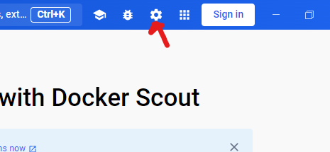
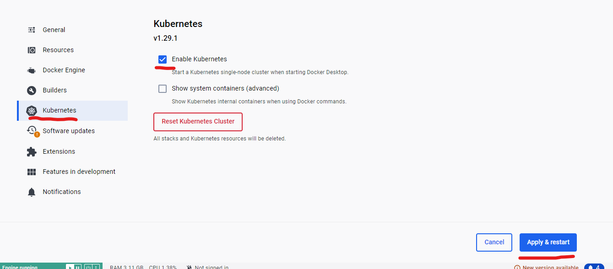

# helm-quotesApp
Uma aplicação simples baseada em flask para demonstrar a utilização do helm.

<p align="center"><a href="https://github.com/joaopedrolourencoaffonso/quotes_bot/tree/main"></a></p>

Para ver como as imagens foram criadas utilizando o Docker, assim como uma forma de executar apenas usando Docker, veja o repositório [docker-quotesApp](https://github.com/joaopedrolourencoaffonso/docker-quotesApp/tree/main). Para as imagens em si, acesse: https://hub.docker.com/u/clusterminator.

Para ver uma versão baseada em objetos de Kubernetes com diferentes níveis de complexida, veja o repositório [kubernetes-quotesApp](https://github.com/joaopedrolourencoaffonso/kubernetes-quotesApp). 

# Como executar

Para executar a aplicação, primeiro, garanta que seu cluster kubernetes esteja funcionando e seu cliente kubernetes esteja conectado ao mesmo.

Eu utilizei o [docker-desktop](https://www.docker.com/products/docker-desktop/) para Windows 11.

Uma vez instalado, clique em `settings`:



Vá em "Kubernetes", clique em habilitar o kubernetes e então clique em "Apply & restart".



Crie o `namespace`.

```bash
$ kubectl create namespace quotes-app
```

Agora abra um terminal de comando (no meu caso foi o wsl) e digite:

```bash
$ helm install quotes-app . --namespace quotes-app
```

A aplicação estará disponível em localhost:30000, acesse a URL e interaja um pouco.

Para parar a aplicação, basta fazer:

```bash
$ helm uninstall quotes-app
```